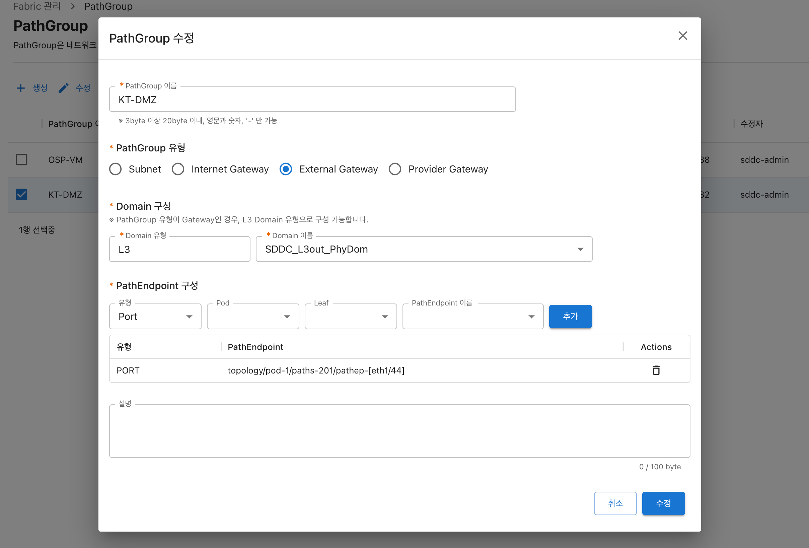

# PathGroup

## 개요

#### 소개

PathGroup 은 네트워크 리소스 생성에 필요한 물리적인 리소스 정보를 관리합니다. 네트워크 리소스 생성 시, 연관된 PathGroup에 등록된 물리적인 리소스가 이용되며 [PathGroup 유형](pathgroup.md#pathgroup) 별로 용도가 구분됩니다.


참고

네트워크 리소스 : [Subnet](../network/subnet.md), Internet Gateway, [External Gateway](../network/external-gateway-1.md), Provider Gateway

물리적인 리소스 : [Domain](domain.md), [PathEndpoint](pathendpoint.md)


#### PathGroup 유형

PathGroup 유형은 용도를 의미하며, 생성 가능한 PathGroup 유형에는 Subnet, Internet Gateway, External Gateway, Provider Gateway가 있습니다. 예로 Subnet 유형의 PathGroup 은 Subnet 생성 시 사용됩니다. 각 유형별로 연결 가능한 Domain 유형은 다음과 같습니다.

<table><thead><tr><th width="336">PathGroup 유형</th><th>Domain 유형</th></tr></thead><tbody><tr><td>Subnet</td><td>Physical</td></tr><tr><td>Internet Gateway</td><td>L3</td></tr><tr><td>External Gateway</td><td>L3</td></tr><tr><td>Provider Gateway</td><td>L3</td></tr></tbody></table>

## 사용 가이드

#### PathGroup 목록 조회

왼쪽 메뉴에서 Fabric 관리 > PathGroup을 클릭하여 PathGroup 목록을 조회합니다.

<figure><figcaption></figcaption></figure>

#### PathGroup 생성

Domain 과 PathEndpoint 를 관리하는 PathGroup을 생성하는 기능입니다.&#x20;

생성 화면에 Domain, PathEndpoint 정보가 조회되지 않는다면, Fabric 동기화를 통해 Domain, PathEndpoint 정보를 등록하는 작업이 필요합니다. Fabric 동기화 작업이 필요하다면 시스템 관리자(sddc.ktcloud@kt.com)에게 문의 하시기 바랍니다.



* 왼쪽 메뉴에서 Fabric 관리 > PathGroup 을 선택합니다.
* PathGroup 목록이 나타나면 상단 메뉴 중 생성 버튼을 클릭합니다.

<figure><figcaption></figcaption></figure>

* PathGroup 생성을 위한 팝업 창이 화면에 나타납니다.



1. **(필수)** PathGroup 이름을 입력합니다.
2. **(필수)** PathGroup 유형을 선택합니다. PathGroup 유형을 선택하면 그에 맞는 Domain 유형이 자동으로 지정됩니다. PathGroup 유형을 Subnet으로 선택하면 Domain 유형은 Physical이 지정되고, PathGroup 유형을 Gateway로 선택하면 Domain 유형은 L3로 선택됩니다.
3. **(필수)** Domain 이름을 선택합니다.
4. **(필수)** PathEndpoint 목록을 구성합니다.
   * 목록에 추가할때 마다 유형, Pod, Leaf, PathEndpoint 이름을 순서대로 선택한 다음 추가 버튼을 클릭합니다.
   * PathEndpoint 유형은 Port, VPC 두가지가 있습니다.
   * 목록에 등록된 PathEndpoint를 삭제하고자 할 경우, 휴지통 🗑 버튼을 클릭합니다.&#x20;
5. (선택) 설명을 입력합니다.

<figure><figcaption></figcaption></figure>

* 팝업 창 우측 하단의 생성 버튼을 클릭합니다.
* 팝업 창이 닫히고, PathGroup 목록 화면에 생성한 PathGroup이 추가된 것이 확인됩니다.



#### PathGroup 수정



* 왼쪽 메뉴에서 Fabric 관리 > PathGroup 을 선택합니다.
* PathGroup 목록 화면이 나타나면 수정하려는 PathGroup을 선택한 다음, 상단의 수정 버튼을 클릭합니다.

<figure><figcaption></figcaption></figure>

* PathGroup 수정을 위한 팝업 창이 화면에 나타납니다.

<figure><figcaption></figcaption></figure>

* [PathGroup 생성](pathgroup.md#2.-pathgroup) 을 참고하여 원하는 내용을 수정 후, 팝업 창 우측 하단의 수정 버튼을 클릭합니다.
* 팝업 창이 닫히고, 수정 사항이 PathGroup 목록에 반영되어 조회됩니다.



#### PathGroup 삭제

PathGroup 정보를 삭제하는 기능입니다. 삭제 대상 PathGroup을 사용 중인 [네트워크 리소스](pathgroup.md#undefined-1)가 없어야합니다.



* 왼쪽 메뉴에서 Fabric 관리 > PathGroup 을 선택합니다.
* PathGroup 목록 화면이 나타나면 삭제하려는 PathGroup을 선택한 다음, 상단의 삭제 버튼을 클릭합니다.

<figure><figcaption></figcaption></figure>



* 팝업 창 우측 하단의 삭제 버튼을 클릭합니다.

<figure><figcaption></figcaption></figure>

* 삭제 팝업 창이 닫히고, PathGroup 목록에서 삭제되었는지 확인합니다.



## FAQ

> **Q. PathGroup 생성이 되지 않습니다.**
>
> A. [PathGroup 생성](pathgroup.md#pathgroup-1) 을 참고해주시기 바랍니다. 만약 해결 되지 않는다면 시스템 관리자(sddc.ktcloud@kt.com)에게 문의 하시기 바랍니다.

> **Q. PathGroup 삭제가 되지 않습니다.**
>
> A. [PathGroup 삭제](pathgroup.md#pathgroup-3) 를 참고해주시기 바랍니다. 만약 해결 되지 않는다면 시스템 관리자(sddc.ktcloud@kt.com)에게 문의 하시기 바랍니다.
